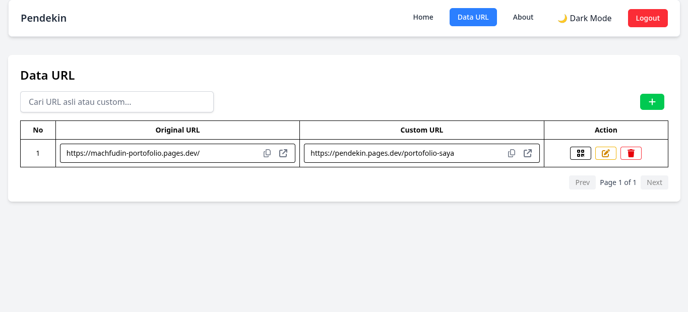

<h1 align="center">Pendekin</h1>

  
  

---

## Deskripsi

Pendekin adalah aplikasi web/mobile untuk memendekkan URL panjang menjadi tautan lebih ringkas dan mudah dibagikan.

## Preview

### 1. Data URL

### 2. Login Page

### 3. Register Page

## Demo

Aplikasi dapat diakses di sini: [pendekin.pages.dev](https://pendekin.pages.dev)

## Fitur - Fitur

- Memendekkan URL dengan satu klik
- Responsive UI Mobile dan Desktop
- Support Dark Mode
- Autentikasi Pengguna via Google, Magic Link Email dan Email & Password
- Pengelolaan URL Pengguna
- Pembuatan URL Custom
- Pembuatan QR Code dari URL

## Teknologi yang Digunakan

Proyek ini dikembangkan menggunakan teknologi berikut:

- React + Vite (Build Tool)
- Tailwindcss
- Supabase (PostgreSQL)
- Cloudflare Pages
